# 示例：《思考，快与慢》深度解读报告（节选）

> 此为虚构的样例输出，仅用于演示 BookMind 报告结构。

## 0. 阅读结论，一页看懂

- **本书解决什么问题**：人脑的两种思维系统（系统 1 / 系统 2）如何影响我们的判断与决策。
- **作者核心观点**：人类远没有自己以为的那么理性；多数错误源于系统 1 的直觉与启发式偏差。
- **最重要的 5 个洞察**：
  1. 系统 1 快速、自动、情绪化；系统 2 慢速、刻意、耗能。
  2. 我们对自身认知能力的自信是过度的。
  3. 启发式是双刃剑：高效但易偏。
  4. 框架效应让理性选择变得困难。
  5. 改善判断需要外部工具与流程。
- **最值得实践的 3 件事**：
  1. 给重要决策写决策日志，强制系统 2 介入。
  2. 用 base rate 校准直觉预测。
  3. 把可逆错误与不可逆错误区分开。

## 1. 全书结构图

```mermaid
mindmap
  root((思考，快与慢))
    第一部分 系统 1 与系统 2
    第二部分 启发式与偏差
    第三部分 过度自信
    第四部分 选择
```

## 2. 章节精读（节选）

### 1. 系统 1 与系统 2
- **一句话摘要**：人脑有两套系统：快的直觉与慢的理性。
- **核心观点**：
  - 系统 1 自动运行，难以关闭。
  - 系统 2 懒惰，常被系统 1 顶替。
- **论证链**：
  - 主张：判断错误源于系统 1 接管。
  - 证据：瞳孔实验、认知负荷实验。
- **值得追问的问题**：
  - 系统 2 是否可被训练成默认运行？
  - 系统 1 的直觉何时可信？

## 3. 核心概念词典

| 概念 | 作者如何使用 | 应用场景 |
| --- | --- | --- |
| **系统 1** | 自动、快速、情绪化 | 解释快决策中的偏差 |
| **系统 2** | 慢速、刻意、耗能 | 解释需要反思的判断 |
| **启发式** | 简化判断的经验法则 | 揭示认知捷径的风险 |
| **锚定效应** | 初始数值影响后续估计 | 谈判、定价 |

## 6. 批判性分析（节选）

- **强论证**：双系统框架有大量实验支持。
- **弱论证**：把一切都归结为"系统 1 偏差"有过度归因之嫌。
- **时代局限**：神经科学部分截至 2010 年代后期已有更新。

## 7. 商业应用（节选）

- **决策日志**：在产品/战略评审前要求团队先写下 3 条 base rate。
- **对照检查**：重要决策走"魔鬼代言人"流程。
- **客户研究**：避免在用户访谈中被表面故事带跑。
